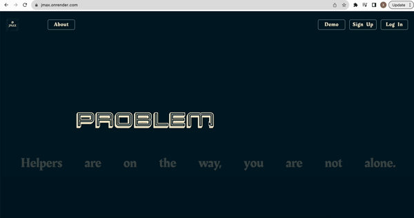
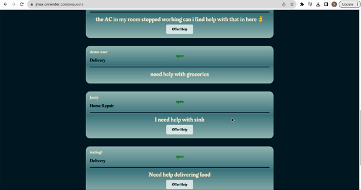
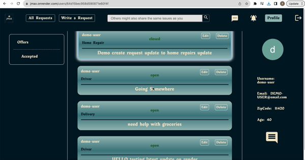

# JMAX

## Background
[JMAX](https://jmax.onrender.com/) is a problem solver web app that allows users to share problems they face in their daily life and look for helps from other people. It's a platform where everyone is included, they can post their problems as requests under three categories, Home Repair, Delivery, and Driver. And others might respond with offers if they can help. The requesters can then choose either to accept the offers or just ignore them.

## Functionality & MVPS
- Users can post, read, update and delete requests
- Users can view other users'profile page but have no permission to edit/modify any parts of it
- Users can respond to other users' problems by giving an offer to them.
- Users can add comments to the offers they accept.
- All users can chat openly in the public chat room by clicking on the chat button in the navigation bar.
- User can also chat privately with another user by clicking onto another user's profile page.

## Wireframes

[Figma Wireframe](https://www.figma.com/file/cfMrJpV8rWh5eTn9W9nTJH/MERN-Wireframe?type=design&node-id=9%3A2&mode=design&t=Pfhp7PTICqIa2JkT-1)(Actual web app looks similar to the wireframe but with more features added)

## Actual Web App

### Splash Page and demo login


### All Requests Page and Profile Page


### Reviews Page


## Code Snippets
### This was the backend to setup the handshake between the client and the server-side.

```js
io.on("connection", (socket) => {
  console.log("a user connected through sockets");
  socket.on("chat message", (msg) => {
    io.emit("chat message", msg);
  });
  socket.on("register user", (userId) => {
    socket.join(userId);
  })
  socket.on("private message", (msg) => {
    if (!msg.content || !msg.sender || !msg.receiver) {
      console.error("Missing required fields in message:", msg);
      return;
    }

    const message = new Message({
      sender: msg.sender,
      receiver: msg.receiver,
      content: msg.content,
    });

    message
      .save()
      .then(() => {
        // Emit the message to the sender and receiver only
        io.to(msg.sender).emit("private message", msg);
        io.to(msg.receiver).emit("private message", msg);
      })
      .catch((err) => {
        console.error("Error saving message:", err);
      });
  });

  socket.on("typing in private", (typingInfo) => {
    io.to(typingInfo.receiver).emit("typing in private", typingInfo);
  });

  socket.on("stop typing in private", (typingInfo) => {
    io.to(typingInfo.receiver).emit("stop typing in private");
  });

  socket.on("typing", () => {
    socket.broadcast.emit("typing");
  });

  socket.on("stop typing", () => {
    socket.broadcast.emit("stop typing");
  });

  socket.on("disconnect", () => {
    console.log("user disconnected");
    socket.leaveAll();
  });
});

```

## Client Side Hanshake snippet

### The client side has to listen to the same messages that the backen is emitting or else the connection wont show all the configurations you want

```js
const PrivateChat = () => {
  const { userId, otherUserId } = useParams();
  const [inputMessage, setInputMessage] = useState("");
  const dispatch = useDispatch();
  const messagesFromStore = useSelector((state) => state.messages);
  const currentUser = useSelector((state) => state.session.user);
  const [isTyping, setIsTyping] = useState(false);
  const [typingUsername, setTypingUsername] = useState("");
  const [typingTimeout, setTypingTimeout] = useState(null);
  const [otherUserUsername, setOtherUserUsername] = useState("");
  const scrollableChatRef = useRef(null);

  useEffect(() => {
    dispatch(fetchMessages(userId, otherUserId));

    socket = io("http://localhost:4000");
    socket.emit("register user", userId);

    socket.on("private message", (msg) => {
      if (msg.sender !== userId) {
        setMessages((prevMessages) => [...prevMessages, msg]);
      }
    });

    socket.on("typing in private", (typingInfo) => {
      if (typingInfo.sender === otherUserId) {
        setIsTyping(true);
        setTypingUsername(typingInfo.username);
      }
    });

    socket.on("stop typing in private", () => {
      setIsTyping(false);
      setTypingUsername("");
    });

    return () => {
      if (typingTimeout) clearTimeout(typingTimeout);
      socket.disconnect();
    };
  }, [userId, otherUserId, dispatch]);

  useEffect(() => {
    setMessages(messagesFromStore);
  }, [messagesFromStore]);

  const [messages, setMessages] = useState([]);

  useEffect(() => {
    const chatContainer = scrollableChatRef.current;
    chatContainer.scrollTop = chatContainer.scrollHeight;
  }, [messages]);

  const handleInputChange = (e) => {
    setInputMessage(e.target.value);

    if (typingTimeout) clearTimeout(typingTimeout);

    if (e.target.value.trim() === "") {
      socket.emit("stop typing in private", {
        sender: userId,
        receiver: otherUserId,
      });
    } else {
      socket.emit("typing in private", {
        sender: userId,
        receiver: otherUserId,
        username: currentUser.username,
      });

      setTypingTimeout(
        setTimeout(() => {
          socket.emit("stop typing in private", {
            sender: userId,
            receiver: otherUserId,
          });
        }, 1000)
      );
    }
  };

  const sendMessage = (e) => {
    e.preventDefault();
    if (inputMessage.trim() === "") {
      return;
    }

    const message = {
      sender: userId,
      receiver: otherUserId,
      content: inputMessage,
    };

    socket.emit("private message", message);
    setMessages((prevMessages) => [...prevMessages, message]);
    setInputMessage("");
  };

  return (
    <div className="chat-box-container">

      <div className="chat-user">{currentUser.username}</div>

      <div className="scrollable-chat" ref={scrollableChatRef}>
        <div className="chat">
          {messages.map((msg, idx) => (
            <div key={idx}
              className={
                msg.sender === userId ? "sent" : "received"} >
              {msg.content}
            </div>
          ))}
        </div>
      </div>

      <p className="typing-message-private-container">
        {isTyping && <span> {typingUsername} is typing...</span>}{" "}
      </p>

      <div className="sticky-input">
        <form onSubmit={sendMessage} className="live-private-chat-input-form">
          <input
            type="text"
            value={inputMessage}
            onChange={handleInputChange}
            placeholder="Enter a message"
          />
          <button type="submit">Send</button>
        </form>
      </div>

    </div>
  );
};
export default PrivateChat;
```

## Implementation Timeline
- __Sunday__: User Authentication is fully implemented.
- __Monday__: Implemented CRUD in the backend for requests, requests can be made and read in the frontend.
- __Tuesday__: Users can update and delete their requests and successfully deployed the web application on render.
- __Wednesday__: Non-requester users are able to make offers and send them directly to the requester, requester can then view them and decide to accept them or leave them pending.
- __Thursday__: Web Socket with both public room chatting and private user to user chatting is fully implemented, styling is added later in the night. Requesters can add reviews to the offers they accepted.
- __Friday Morning__: Finished About Page and styling of the chatbox.

## Current Progress
- [x] Splash page is set up to give users a unique experience visiting our web app.
- [x] Users can register for a new account, login, and logout.
- [x] Users can click into About Page to read a small paragraph of the web app's usage and go checkout our team members' GitHub profile.
- [x] A user can be both a requester or a helper where he/she can post requests and also offering help to other users.
- [x] Users can create requests and read it on 'All Requests' Page or on their own profile pages.
- [x] Users can perform update and delete operations on their own requests.
- [x] Users can make offers to other's users requests.
- [x] The Requesters can add comments to the offers that they accepted.

### Bonus features:
- [ ] Receiving chat notification
