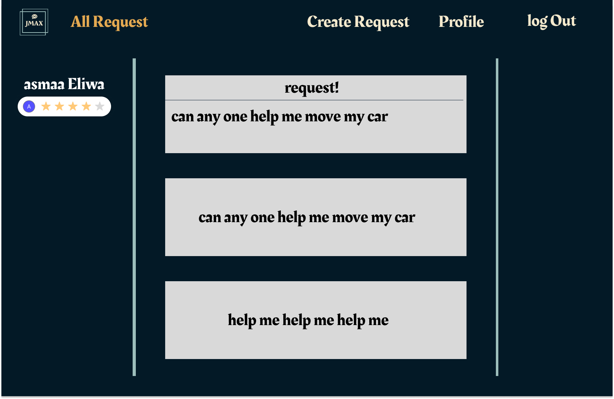

# JMAX

## Background
[JMAX](https://jmax.onrender.com/) is a problem solver web app that allows users to share problems they face in their daily life and look for helps from other people.

## Functionality & MVPS

## Instructions

## Wireframes

[Figma Wireframe](https://www.figma.com/file/cfMrJpV8rWh5eTn9W9nTJH/MERN-Wireframe?type=design&node-id=9%3A2&mode=design&t=Pfhp7PTICqIa2JkT-1)(Actual web app looks similar to the wireframe but with more features added)

## Code Snippets

## Implementation Timeline
- __Sunday__: User Authentication is fully implemented.
- __Monday__: Implemented CRUD in the backend for requests, requests can be made and read in the frontend.
- __Tuesday__: Users can update and delete their requests and successfully deployed the web application on render.
- __Wednesday__: Non-requester users are able to make offers and send them directly to the requester, requester can then view them and decide to accept them or leave them pending.
- __Thursday__: Web Socket with both public room chatting and private user to user chatting is fully implemented, styling is added later in the night. Requesters can add reviews to the offers they accepted.
- __Friday Morning__: Finished About Page and styling of the chatbox.

## Current Progress
- [x] Splash page is set up to give users a unique experience visiting our web app.
- [x] Users can register for a new account, login, and logout.
- [x] Users can click into About Page to read a small paragraph of the web app's usage and go checkout our team members' GitHub profile.
- [x] A user can be both a requester or a helper where he/she can post requests and also offering help to other users. 
- [x] Users can create requests and read it on 'All Requests' Page or on their own profile pages.
- [x] Users can perform update and delete operations on their own requests.
- [x] Users can make offers to other's users requests.
- [x] The Requesters can add comments to the offers that they accepted.

### Bonus features:
- [ ] Receiving chat notification
